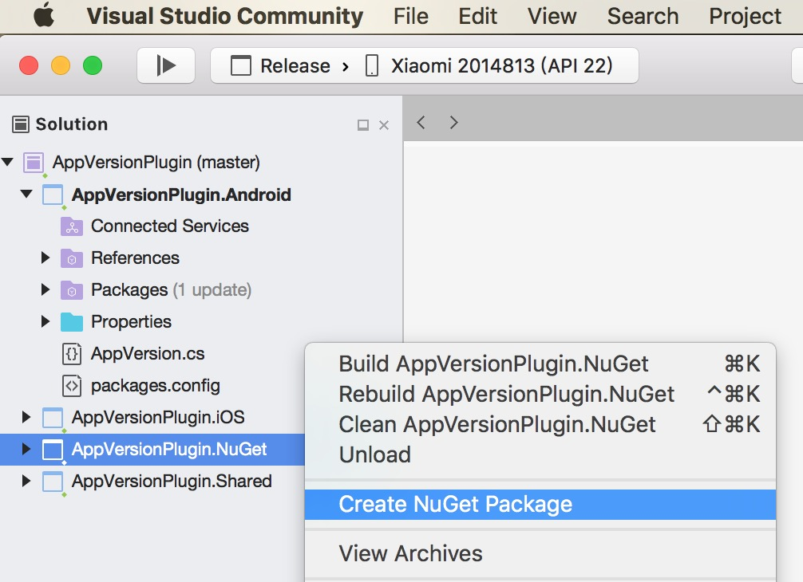
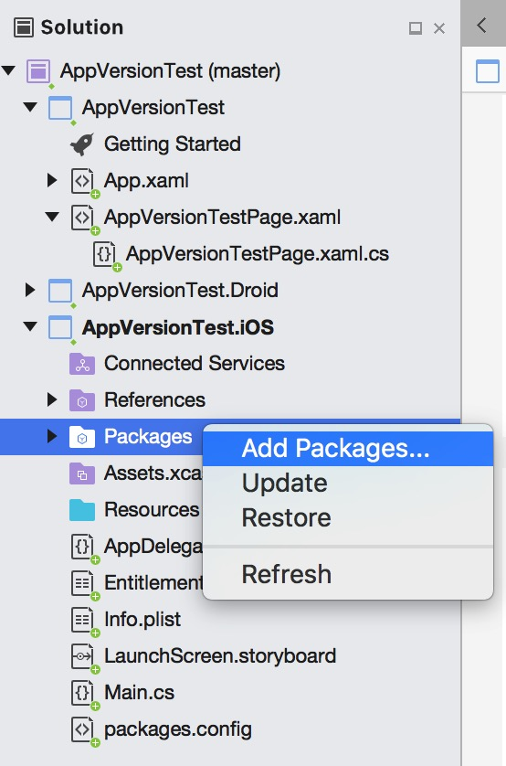
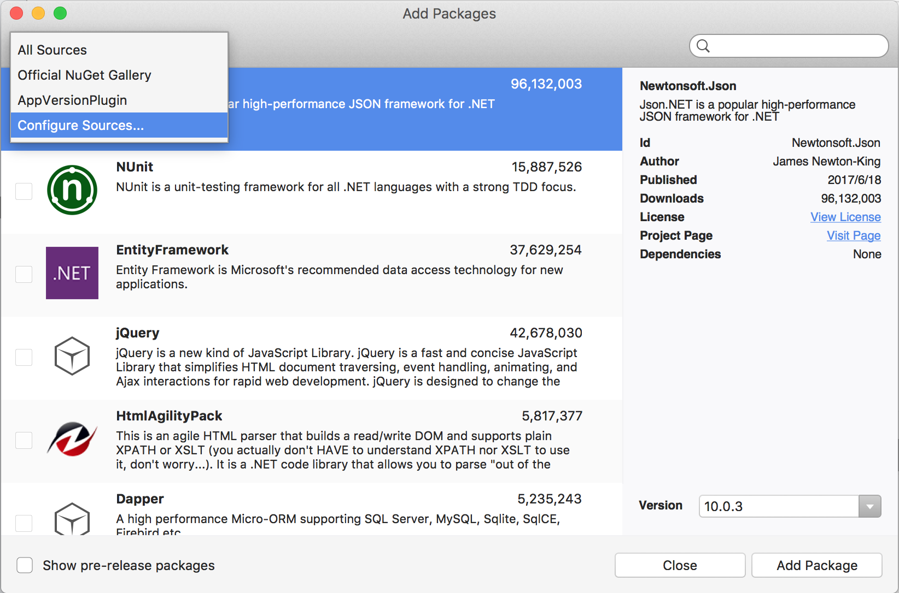
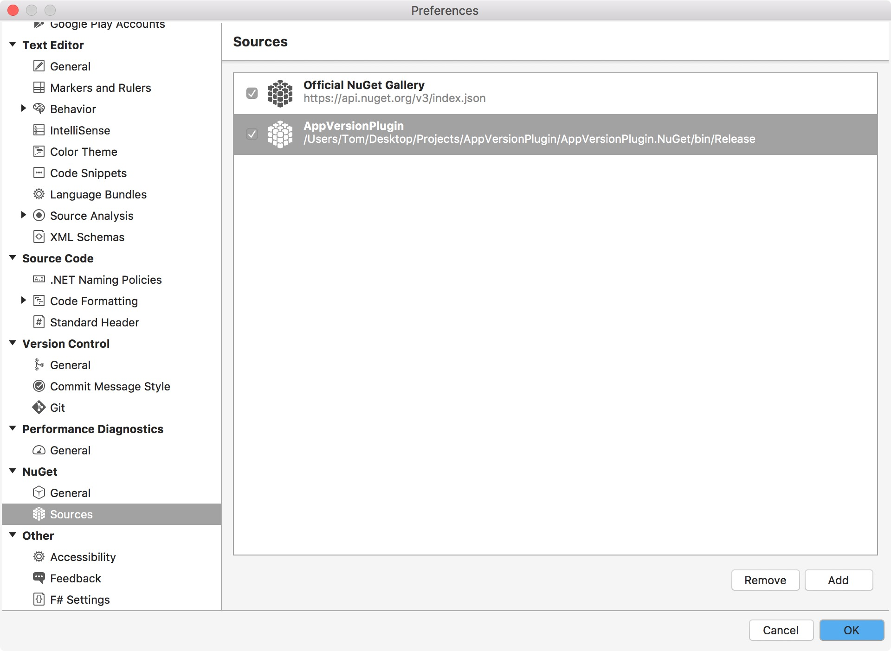

# Compile

Clone the plugin project and open it with Visual Studio for Mac, right click on AppVersionPlugin.NuGet project and select "Create Nuget Package". If it works, you will find the .nupkg file in bin/Debug or bin/Release of AppVersionPlugin.NuGet folder.

# Add to project

Add Packages -> Configure Sources -> Add, navigate to the locaction where .nupkg file is

